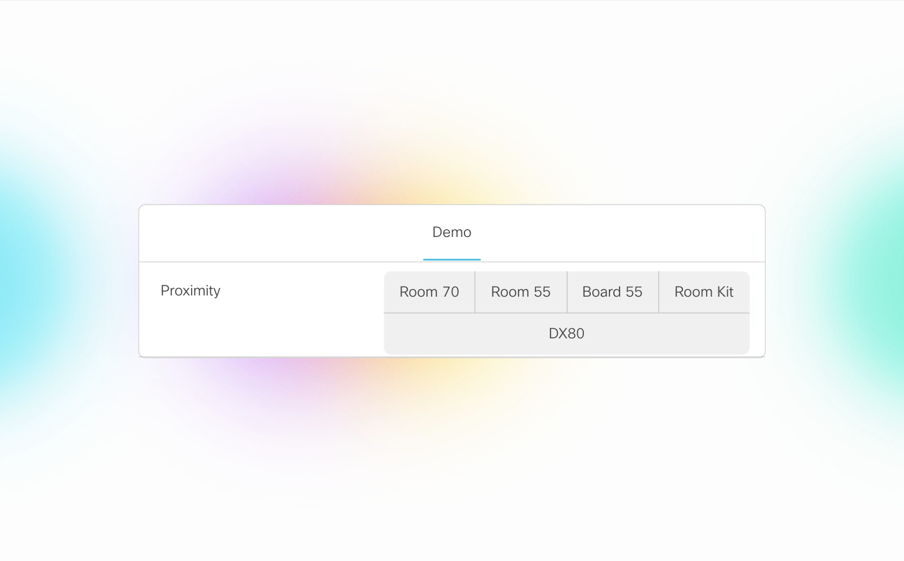

# Proximity manager for Webex devices

## Description

When you have more than one Webex device in the same room, ultrasound signals (used for Proximity pairing) from all devices can conflict. This script will allow you to define a master device and pick which device should emit ultrasound in the room (while turning off the other devices) from the master device Touch 10.

Here below is the representation of the master device Touch 10.

In the above example, clicking on *Board 55* would set the ultrasound volume of the Board 55 to its maximum level while turning down the ultrasound volume of all other devices to zero.

## Prerequisites

- ADMIN or INTEGRATOR credentials of Webex devices
- A VM running Python 3 (with modules *flask* and *requests*) on the same local network as the Webex devices

## Touch 10 Panel Setup

1. Access the local web interface of the master Webex device ([procedure](https://help.webex.com/en-us/n5pqqcm/Advanced-Settings-for-Room-and-Desk-Devices))
2. Enable the HTTP client (be aware of security implications of enabling insecure HTTPS):
     > Setup > Configuration > HttpClient > AllowInsecureHTTPS > True

     and

     > Setup > Configuration > HttpClient > Mode > On
3. Navigate to:
     > Integration > In-Room Control > Launch Editor

4. Open the menu in the upper-right corner, select *Import from file* and find [roomcontrolconfig.xml](./roomcontrolconfig.xml)
5. Add/remove/replace buttons to fit with the devices in your room

## VM Setup

1. Fill in [devices.json](./devices.json) with your devices. The first one in the list is the master device on which the panel has been deployed.
2. In [ultrasound.py](./ultrasound.py), fill in the IP address of the VM in *SERVER_URL* (which needs to be in the same local netword as the devices)
3. Run the Python script which will launch a Flask web app (on port 8081). You can do so by using *nohup* (experimental):
     > nohup python -u ultrasound.py &
4. Navigate to:
     >  http://SERVER_URL:8081/
     
     in a browser to point the master device to the web app
5. Try it

